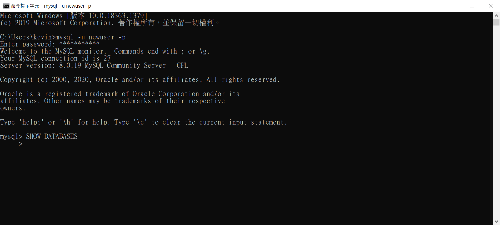
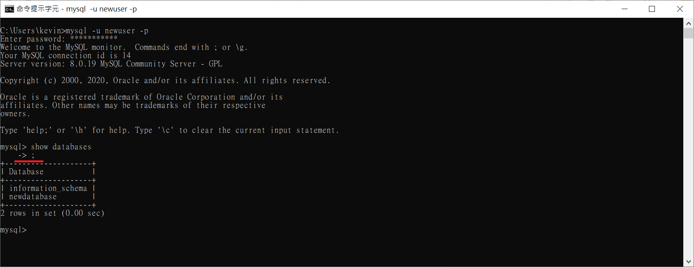

## 閱讀順序

login -> database -> table -> crud

crud 為 create, read, update, delete

需要新增使用者再看 permission

## 注意事項

在輸入指令的時候很常遇到如下圖的狀況：



那是因為指令忘記加 ";" 就按 Enter，補上 ";" 即可



## 查看版本

* **在資料庫未登入的時候**

```
mysql -V
```

* **在資料庫登入的時候**

```
SELECT VERSION();
```

## 在 MySQL console 執行 system 的指令

* **前面加個 system 即可**

```
system cls
```