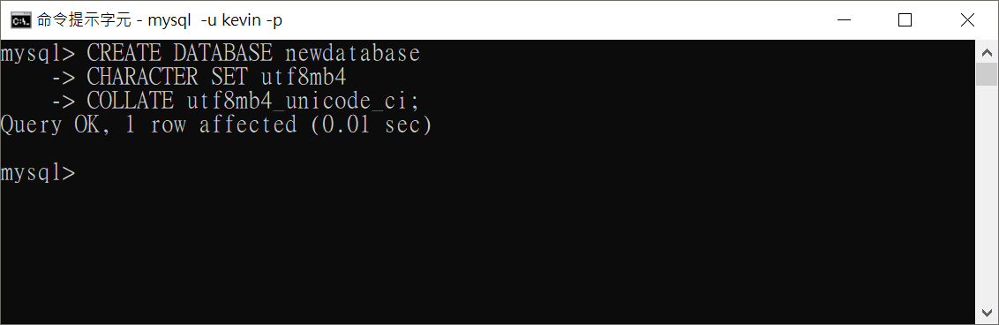
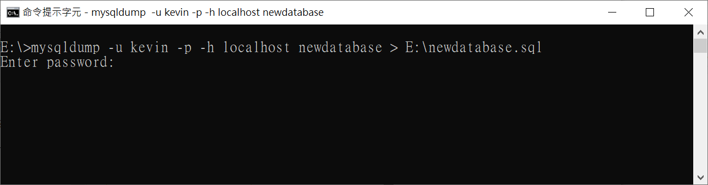

## 資料庫基本操作

以 **資料庫：newdatabase** 做為範例說明

* **查看所有資料庫**

```
SHOW DATABASES;
```

* **查看特定資料庫的原始碼**

```
SHOW CREATE DATABASE newdatabase;
```

* **切換資料庫**

    > 切換資料庫後才能做 **table** 的操作，請參閱：[table](./table.md)

```
USE newdatabase;
```

* **建立資料庫**

```
CREATE DATABASE newdatabase;
```

* **建立資料庫，並設定 CHARACTER SET 及 COLLATE**

    > 基本上都是以 utf8mb4 為主

```
CREATE DATABASE newdatabase
CHARACTER SET utf8mb4
COLLATE utf8mb4_unicode_ci;
```

建議每輸入一行就按一次 Enter，執行結果如下圖：

 

* **修改資料庫 CHARACTER SET 及 COLLATE 設定**

    > 以 utf8mb4 為例

```
ALTER DATABASE newdatabase
CHARACTER SET utf8mb4
COLLATE utf8mb4_unicode_ci
```

也是一樣建議每輸入一行就按一次 Enter


* **移除資料庫**

```
DROP DATABASE newdatabase;
```

## 資料庫備份及還原

1. 需在**資料庫未登入**的狀態下操作，即另開一個新的cmd
2. 帳號需要有 **SUPER privilege**
3. 本文以 **帳號：kevin，目標資料庫：newdatabase，備份檔：E:\newdatabase.sql** 做為範例

* **備份資料庫**

```
mysqldump -u kevin -p -h localhost newdatabase > E:\newdatabase.sql
```



再輸入密碼即可完成備份

* **備份資料庫(含 Stored Procedure/Stored Function/Trigger)**

    > 需注意 **DEFINER** 不會因為備份帳號的不同而有所改變

```
mysqldump --routines -u kevin -p -h localhost newdatabase > E:\newdatabase.sql
```

* **還原資料庫**

```
mysql -u kevin -p -h localhost newdatabase < E:\newdatabase.sql
```

