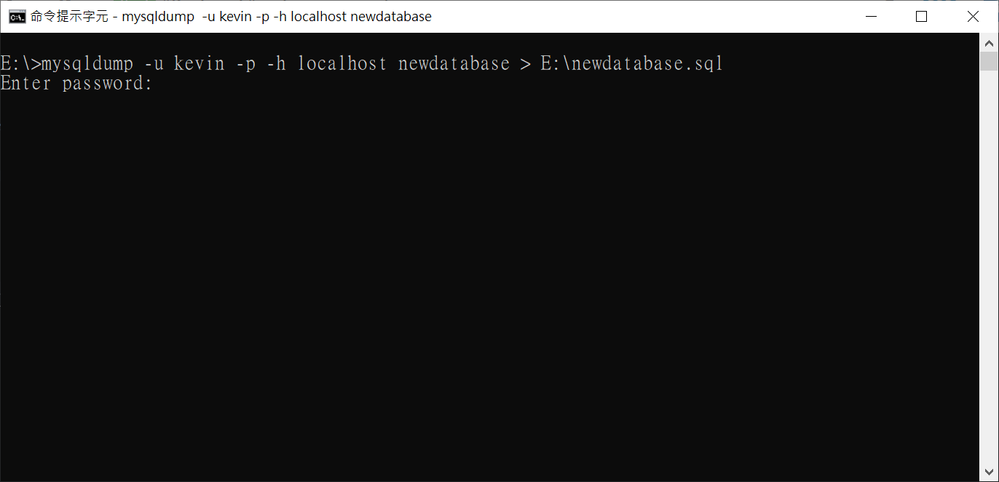

## 資料庫基本操作

以 **資料庫：newdatabase** 做為範例說明

* **建立資料庫**

```
CREATE DATABASE newdatabase;
```

* **切換資料庫**

```
USE newdatabase;
```

* **移除資料庫**

```
DROP DATABASE newdatabase;
```

## 資料庫備份及還原

1. 需在**資料庫未登入**的狀態下操作，即另開一個新的cmd
2. 帳號需要有 **SUPER privilege**
3. 本文以 **帳號：kevin，目標資料庫：newdatabase，備份檔：E:\newdatabase.sql** 做為範例

* **備份資料庫**

```
mysqldump -u kevin -p -h localhost newdatabase > E:\newdatabase.sql
```



再輸入密碼即可完成備份
