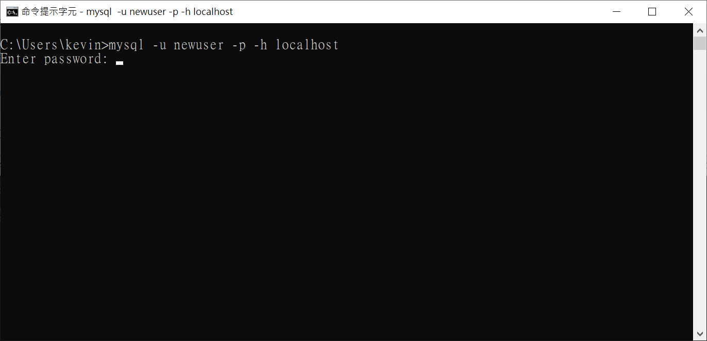
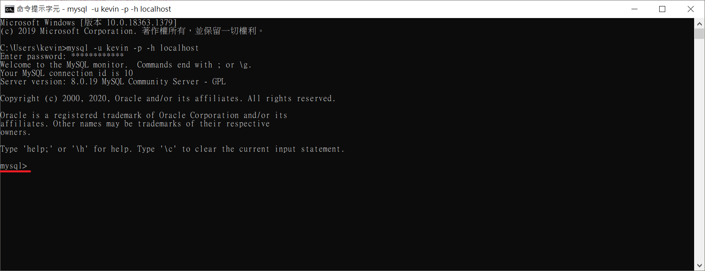

## DB Login

**語法：mysql -u 'username' -p -h localhost**

e.g. 假設使用者為 newuser

```
mysql -u newuser -p -h localhost
```

執行結果如下圖：



再輸入密碼即可完成登入，執行結果如下圖：



---

**語法：mysql -u'username' -p'password' -h localhost (不安全)**

e.g. 假設使用者為 newuser，密碼為 newpassword

```
mysql -unewuser -pnewpassword -h localhost
```