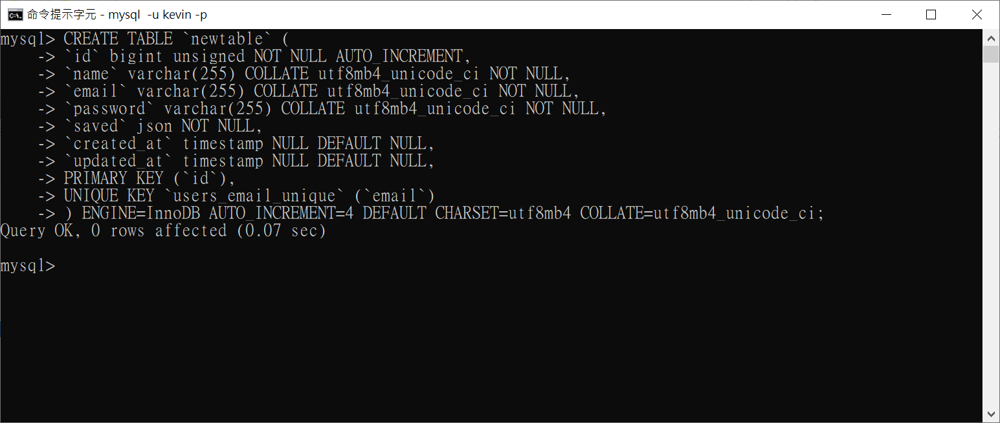

## 資料表基本操作

1. 資料表的操作**需要先切換到 database**，請參閱：[database](./database.md)
2. 本文以 **資料表：newtable**做為範例

* **查看所有資料表**

```
SHOW TABLES;
```

* **查看特定資料表 shema**

```
DESCRIBE newtable;
```

* **查看特定資料表原始碼**
```
SHOW CREATE TABLE newtable;
```

* **建立資料表**

1. 需特別注意**資料表的 CHARACTER SET 跟 COLLATE 要與資料庫一致**
2. 基本上都是以 **utf8mb4** 為主

|Field     |Type           |Key |
|----------|---------------|----|
|id        |bigint unsigned|PRI |
|name      |varchar(255)   |    |
|email     |varchar(255)   |UNI |
|password  |varchar(255)   |    |
|saved     |json           |    |
|created_at|timestamp      |    |
|updated_at|timestamp      |    |

```
CREATE TABLE `users` (
  `id` bigint unsigned NOT NULL AUTO_INCREMENT,
  `name` varchar(255) COLLATE utf8mb4_unicode_ci NOT NULL,
  `email` varchar(255) COLLATE utf8mb4_unicode_ci NOT NULL,
  `password` varchar(255) COLLATE utf8mb4_unicode_ci NOT NULL,
  `saved` json NOT NULL,
  `created_at` timestamp NULL DEFAULT NULL,
  `updated_at` timestamp NULL DEFAULT NULL,
  PRIMARY KEY (`id`),
  UNIQUE KEY `users_email_unique` (`email`)
) ENGINE=InnoDB AUTO_INCREMENT=1 DEFAULT CHARSET=utf8mb4 COLLATE=utf8mb4_unicode_ci;
```

建議每輸入一行就按一次 Enter，執行結果如下圖：



**程式碼非常長**，建議用熟悉的 DBMS 建立資料表

* **清空資料表**

```
TRUNCATE TABLE newtable;
```

* **刪除資料表**

```
DROP TABLE newtable;
```